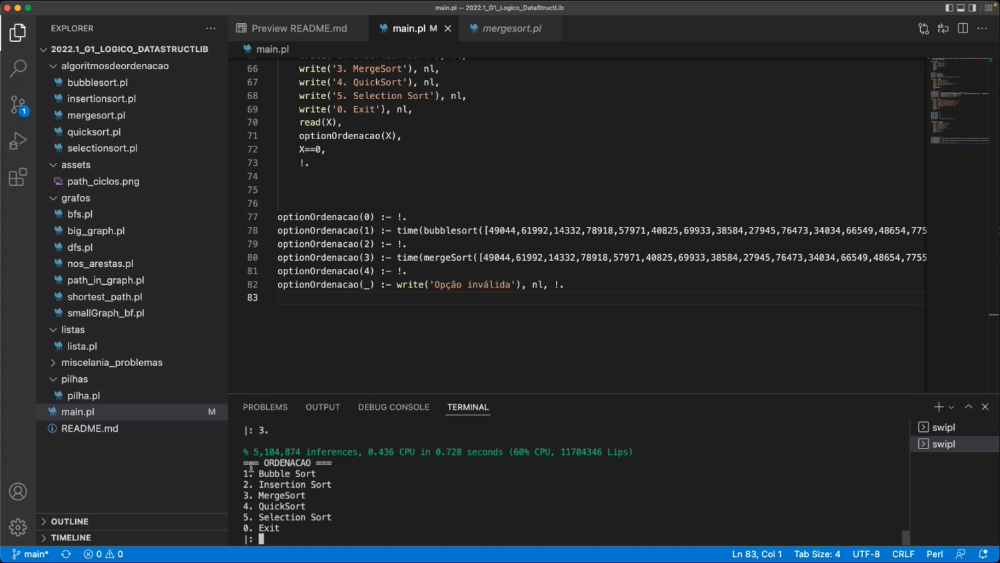
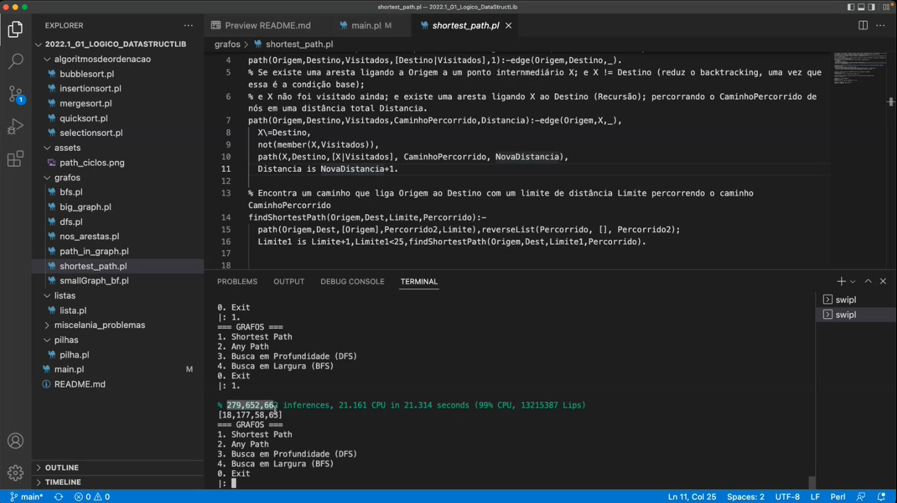
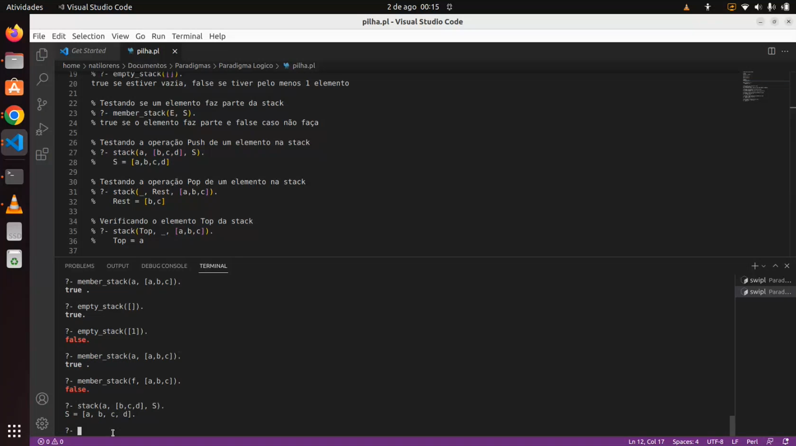
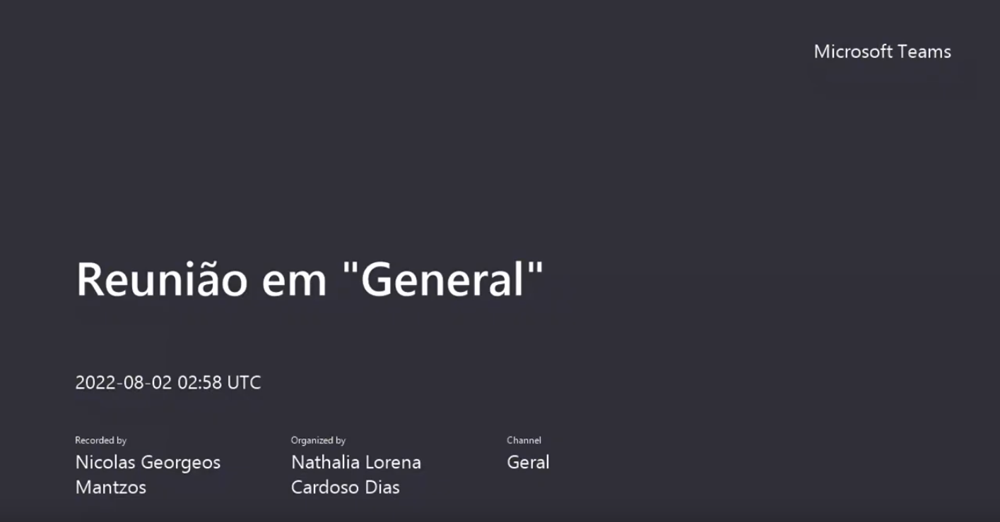
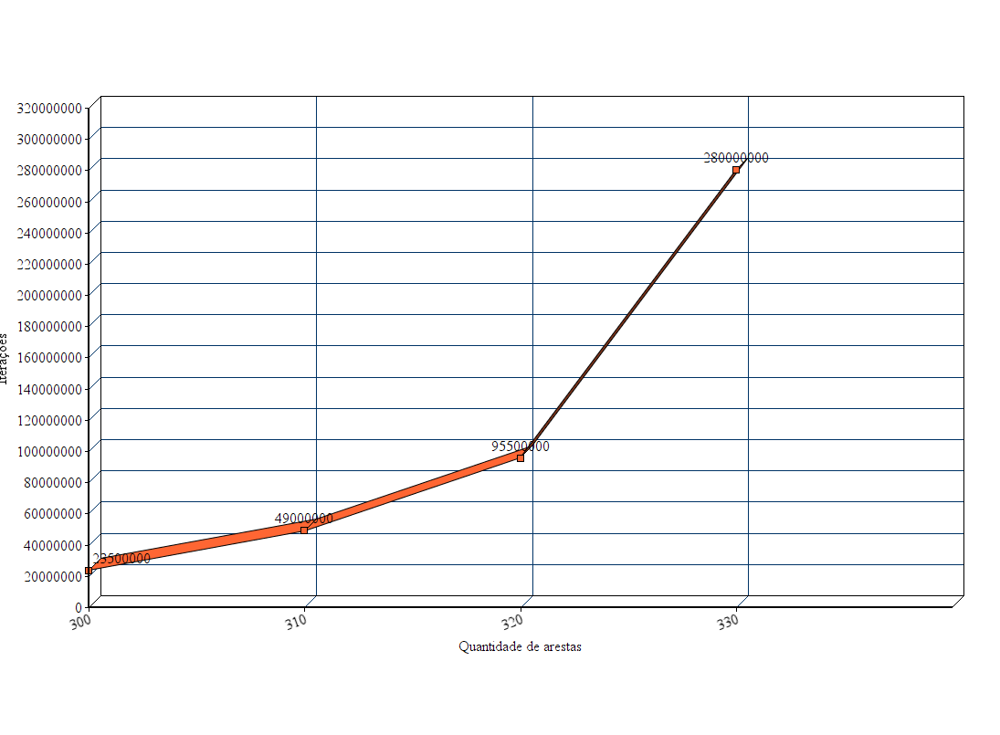

# Biblioteca de Estruturas de Dados (Prolog)

**Disciplina**: FGA0210 - PARADIGMAS DE PROGRAMAÇÃO - T01 <br>
**Nro do Grupo**: 01<br>
**Paradigma**: Lógico<br>

## Alunos
|Matrícula | Aluno |
| -- | -- |
| 18/0013637 | Arthur Paiva Tavares |
| 18/0117548 | Bruno Carmo Nunes |
| 16/0028361 | Gabriel Batista Albino Silva |
| 14/0156909 | Nathalia Lorena Cardoso Dias |
| 17/0051277 | Nicolas Georgeos Mantzos |
| 17/0114333 | Sofia Costa Patrocinio |
| 19/0048760 | Wellington Jonathan de Souza Rodrigues |
## Sobre 
O objetivo é construir uma biblioteca que agrege as principais estruturas de dados acompanhadas de seus algoritmos
principais para as operações de inserção, ordenação, deleção e busca implementados no paradigma lógico. 

Acompanhada dessas implementações, serão realizadas análises comparativas de desempenho e complexidade em relação ao que foi escrito no paradigma anterior (funcional) .
## Screenshots





## Instalação 
### Prolog

Inicialmente é necessario que  instale a plataforma do SWI Prolog. Se você estiver no linux baseado no Debian, basta copiar a seguinte linha no seu terminal:
```
 $ sudo apt-add-repository ppa:swi-prolog/stable
 $ sudo apt-get update
 $ sudo apt-get install swi-prolog
```

Clone este repositório:

```
$ git clone <https://github.com/UnBParadigmas2022-1/2022.1_G1_Logico_DataStructLib>
```

## Uso 
- Executar, no diretório do projeto, o comando `swipl` para acesso ao interpretador prolog
- Carregar o módulo principal digitando `[main].`.
- Adentrar no menu digitando `menu.`.


# Vídeo

[](https://www.youtube.com/watch?v=tsrQ9vISFic)

## Participações
A tabela abaixo sintetiza, nas palavras do contribuidor, as contribuições acompanhadas de sua respectiva significância.
|Nome do Membro | Contribuição | Significância da Contribuição para o Projeto (Excelente/Boa/Regular/Ruim/Nula) |
| -- | ---- | - |
| Arthur Paiva Tavares  | - | - |
| Bruno Carmo Nunes  | Feito a pesquisa e implementação do mergesort e também do insertionsort. Foi também feito uma lista de 100000 variáveis para ordenação com mergeSort, e análisado a eficiência com essa complexidade. | Regular |
| Gabriel Batista Albino Silva | Adicionado algoritmo de encontrar a menor distância em um grafo utiliando o backtracking do Prolog. A implementação encontra-se no arquivo "graph/shortest_path.pl" e sua implementação utiliza bastante do paradigma lógico e a camada de controle do prolog, ao inves da implementação que fiz no paradigma funcional onde era utilizado kruskals ou bellman ford para o calculo da menor distância. |
| Nathalia Lorena Cardoso Dias  | Foi adicionada a estrutura de Pilha feita em Prolog.| Boa |
| Nicolas Georgeos Mantzos  | Implementação dos algoritmos "Busca em Largura"  e "Busca em Profundidade" para travessia de grafos e adição de problema pontuais a sessão de miscelânica.  | Boa |
| Sofia Costa Patrocinio  | - | - |
| Wellington Jonathan de Souza -  | Inclusão dos algoritimos bubblesort e quicksort em Prolog.| Regular |

## Percepções gerais, lições aprendidas, fragilidades superadas...
A tabela abaixo compila as percepções e lições aprendidas por cada participante no desenvolvimento do segundo módulo do projeto.

|Nome do Membro | Comentário | 
| -- | ---- |
| Arthur Paiva Tavares  | Não Preenchimento no Prazo - Profa. Milene | Não Preenchimento no Prazo - Profa. Milene
| Bruno Carmo Nunes  | Achei muito mais tranquilo do que implementar no trabalho passado, sendo que foi testando o tempo de operação, onde temos um feedback da análise do algoritmo. Sendo assim, foi tentando também implementar o insertionsort, porém por o algoritmo ser de um complexidade mais alta, o prolog não aguentou o arquivo de 100000 variaveis. Estourando a memória. Por falta de organização do meu cronograma, acabei deixando de lado melhorias possíveis. | 
| Gabriel Batista Albino Silva  | Um dos desafios que eu tive durante a implementação desse projeto foi a dificuldade de implementar algoritmos otimizados de menor caminho possível em grafos, uma vez que esses algoritmos necessitam de estruturas de controle de estado que são dificeis de gerenciar no paradigma lógico. Já existem imlementações realizadas anteriormente desses algoritmos em prolog como  citado na referência, porém a implementação foi realizada de maneira demasiadamente imperativa, conforme o próprio autor destaca. Portanto, ao invés de implementar esses algoritmos, decidi implementar algo mais voltado para o pardigma lógico, utilizando recursos de backtracking e recursão para encontrar o menor caminho possível entre dois pontos em um grafo. No meu entender a implementação realizada está de acordo com as espectativas do projeto, que é comparar algoritmos em diferentes paradigmas, e creio que a implementação no paradigma lógico se destaca das demais no quesito de ser única. |
| Nathalia Lorena Cardoso Dias  | Eu achei bastante interessante o paradigma lógico, tive várias ideias do que poderia ser explorado usando ele. No entanto, com a dificuldade de conciliar o tempo com as outras disciplinas, continuei com a mesma ideia do que tinha desenvolvido na entrega anterior, mas agora usando prolog, e mesmo trabalhando com uma estrutura de dados simples, não deixei de presenciar dificuldades e desafios com o prolog. Utilizei referências para ajudar na construção da estrutura e elas estão citadas em Referências.|
| Nicolas Georgeos Mantzos  | Achei o paradigma muito gostoso de se trabalhar, sobretudo pela minha experiência com proposições, operações lógicas e predicados, temas títpicos da lógica de primeira ordem que forem utilizados à exaustão durante a escrita do código. Entretanto, ainda não fui capaz de discernir entre as ideias de recursão e backtracking, dado que ainda vejo um como a implicação natural e complementar do outro, não como conceitos distintos. De resto, reaproveitei o pensamento recursivo trabalhado no paradigam funcional.   |
| Sofia Costa Patrocinio  | Não Preenchimento no Prazo - Profa. Milene | Não Preenchimento no Prazo - Profa. Milene
| Wellington Jonathan de Souza Rodrigues  | Achei interessante e desafiador trabalhar com prolog,pude perceber que nesse paradigma, assim como no funcional, a utilização de lista e essencial embora a forma de trabalhar nesse paradigma tenha me forçado a  pensar de formas diferente. |

### Menor caminho em grafos
É possível perceber que devido ao uso do backtracking, a complexidade do algoritmo cresce rapidamente com o acrescimo de novas aresatas, como é exibido no grafico abaixo:


## Trabalhos Futuros

* Realizar a implementação de algoritmos classícos de busca em grafos para contrastar com a visão lógica apresentada. 


## Fontes
- Menu: Obtido do moodle, arquivo "Menu de escolha.zip".
- Usado como referência inicial para implementação de grafos: [AI L9 P1 Prolog: Introduction to Prolog with graph search](https://www.youtube.com/watch?v=odZ1tnlhYSY)
- Usado como referência para consulta dos algoritmos padrões em prolog (Não foi implementado, consultar percepções do Gabriel Albino para detalhes): [Bellman-Ford algorithm implemented in Prolog](https://github.com/tchap/prolog-bellman-ford/blob/master/bf.pl)

- Usado como referência para consulta do algoritmo de Pilha em prolog: [How to implement stack](https://stackoverflow.com/questions/2978130/prolog-how-to-implement-stack)
- Usado como referência para consulta do algoritmo de ordenação em prolog : [Programas Prolog para processamento de Lista e Aplicações]
(http://www.ppgia.pucpr.br/~fabricio/ftp/Aulas/Programa%E7%E3o%20L%F3gica%20-%20Tecpar/listas-prolog.pdf)
